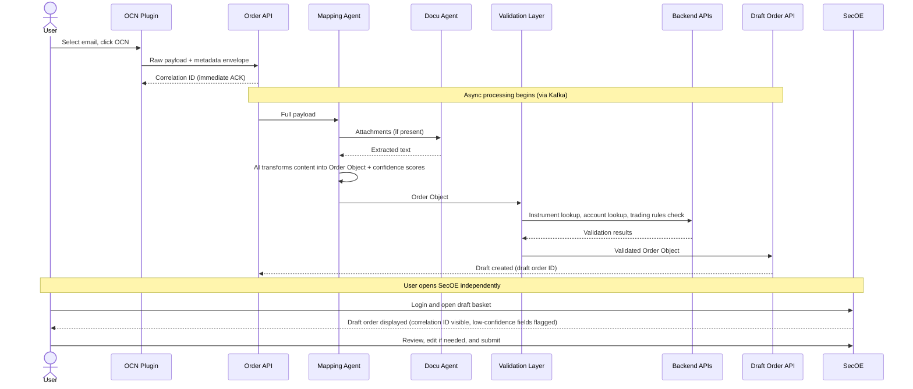

# OCN GitLab Wiki — All Pages (Consolidated)
# =============================================
# Instructions:
# 1. Open each section marked "## GITLAB PAGE:" in order
# 2. In GitLab Wiki, click "New page"
# 3. Enter the title exactly as shown after "TITLE:"
# 4. Paste the content below the title line into the page body
# 5. Click "Create page"
# 6. Repeat for all 18 pages
#
# TIP: The "/" in titles like "Overview/Business-Problem"
# automatically creates the nested hierarchy in GitLab Wiki sidebar.
# =============================================

================================================================================
## GITLAB PAGE 1 OF 18
## TITLE: Home
================================================================================

# OCN — Outlook Client Order Notification

## What is OCN?

OCN is an AI-powered workflow that automates the capture of client trade
instructions received via email. It reduces manual order entry, accelerates
order processing, and introduces agentic AI into the Order Capture and
Validation journey at UBS.

## Scale

| Channel        | Annual Volume       |
|----------------|---------------------|
| Email (OCN)    | ~800,000 orders     |
| Other channels | ~300,000 orders     |
| **Total**      | **~1.1 million orders** |

## Quick Links

- [Overview](Overview)
- [Business Problem](Overview/Business-Problem)
- [High-Level Architecture](Architecture/High-Level-Architecture)
- [Sequence Diagram](Architecture/Sequence-Diagram)
- [ADR-0001: OCN Draft Order Creation](ADRs/ADR-0001)
- [ADR-0002: Orchestration Pattern](ADRs/ADR-0002)
- [ADR-0003: Mapping Agent Governance](ADRs/ADR-0003)
- [ADR-0004: Human-in-the-Loop Policy](ADRs/ADR-0004)
- [Stage-by-Stage Analysis](Architecture/Stage-by-Stage-Analysis)
- [Open Items](Open-Items)
- [Decision Log](Decision-Log)
- [Backlog and Next Steps](Backlog-and-Next-Steps)

## Status

| Item                          | Status     |
|-------------------------------|------------|
| ADR-0001                      | Proposed   |
| ADR-0002                      | Proposed   |
| ADR-0003                      | Proposed   |
| ADR-0004                      | Proposed   |
| Sequence Diagram              | Draft      |
| Component Diagram             | Draft      |
| Stage-by-Stage Analysis       | Draft      |
| Order Object Schema           | Pending    |
| Orchestration Decision        | Pending    |

## Component Overview

| Component | Type | Status |
|---|---|---|
| OCN Plugin | New | To build |
| Order API | New | To build |
| Mapping Agent | New | To build |
| Validation Layer | New | To build |
| Docu Agent | Existing | Black box |
| Draft Order API | Existing | Black box |
| SecOE | Existing | Integration required |


================================================================================
## GITLAB PAGE 2 OF 18
## TITLE: Overview
================================================================================

# Overview

This section covers the business context, scope, and shared terminology for the OCN workflow.

## Child pages

- [Business Problem](Overview/Business-Problem)
- [Scope and Goals](Overview/Scope-and-Goals)
- [Glossary](Overview/Glossary)


================================================================================
## GITLAB PAGE 3 OF 18
## TITLE: Overview/Business-Problem
================================================================================

# Business Problem

UBS processes approximately 1.1 million trade orders per year received via
client communications. Around 800,000 arrive via email — making email the
dominant channel for order intake. The remaining orders come through other
channels including Secure Messaging, telephone calls, and fax.

Today, the end-to-end capture of email-based orders is a **manual process**.
Relationship managers or operations staff read incoming emails and attachments,
interpret the client's trade instructions, and manually key order details into
the SecOE order entry system. This process is:

- **Error-prone** — manual transcription introduces the risk of keying mistakes on instrument, quantity, price, and side.
- **Slow** — high volumes create processing queues, delaying order capture and increasing market risk exposure.
- **Operationally costly** — a significant portion of the operations headcount is dedicated to routine order transcription.
- **Lacking a structured audit trail** — unstructured email instructions are not natively tied to the resulting order record in a traceable, automated way.

OCN automates this capture journey using AI agents, eliminating manual
transcription while preserving mandatory human review before any order
reaches the market.

This is also the first initiative to introduce Agentic AI into the Order Capture
and Validation journey at UBS, establishing patterns and guardrails that future
workflows can build upon.

See [ADR-0001](../ADRs/ADR-0001) for the full context and decision record.


================================================================================
## GITLAB PAGE 4 OF 18
## TITLE: Overview/Scope-and-Goals
================================================================================

# Scope and Goals

## In scope

- Automated extraction of trade instructions from client emails via Outlook plugin
- AI-powered mapping of unstructured email content to a structured Order Object
- Integration with existing Docu Agent, Draft Order API, and SecOE
- Mandatory human review and submission via SecOE
- Complete audit trail from originating email to submitted order

## Out of scope

- Automated order submission without human review
- Non-email channels (Secure Messaging, calls, fax) — future phases
- Changes to SecOE order lifecycle beyond draft order basket display and confidence surfacing

## Goals

| Goal | Measure |
|---|---|
| Reduce manual transcription effort | Operations headcount hours saved per year |
| Reduce market risk exposure window | Time from email receipt to draft order ready in SecOE |
| Establish reusable agentic AI pattern | Number of future workflows adopting the same pattern |
| Provide complete audit trail | 100% of OCN orders traceable from email to submitted order |


================================================================================
## GITLAB PAGE 5 OF 18
## TITLE: Overview/Glossary
================================================================================

# Glossary

| Term | Definition |
|---|---|
| OCN | Outlook Client Order Notification — the workflow and Outlook plugin |
| Correlation ID | Unique identifier generated by the Order API per submission, used to track a request end-to-end across all components |
| Order Object | The structured, normalised representation of a trade instruction produced by the Mapping Agent |
| Mapping Agent | New AI agent responsible for extracting and normalising trade instructions from email content into an Order Object |
| Docu Agent | Existing agent responsible for OCR and text extraction from attachments — treated as a black box |
| Draft Order API | Existing API that creates draft orders in the trading system — treated as a black box |
| SecOE | Existing order entry GUI where users review, edit, and submit draft orders |
| DLQ | Dead-Letter Queue — holds failed pipeline messages for ops team triage and reprocessing |
| Confidence score | A 0.0–1.0 value per field produced by the Mapping Agent indicating extraction certainty |
| Correction Store | Data store capturing field-level diffs between Mapping Agent output and user submissions — used for accuracy tracking and model improvement |
| Golden dataset | Labelled set of historical or synthetic emails with known correct Order Objects, used for accuracy evaluation |
| Validation layer | New component that validates the Order Object against trading rules and reference data before submission to Draft Order API |
| Email message ID | The unique identifier of the originating email in Outlook, used as the idempotency key for deduplication in the Order API |
| Human-in-the-loop | The mandatory SecOE review step — no OCN-created draft order can be submitted to the trading system without explicit human approval |


================================================================================
## GITLAB PAGE 6 OF 18
## TITLE: Architecture
================================================================================

# Architecture

This section contains all architectural artefacts for the OCN workflow.

## Child pages

- [High-Level Architecture](Architecture/High-Level-Architecture)
- [Sequence Diagram](Architecture/Sequence-Diagram)
- [Component Diagram](Architecture/Component-Diagram)
- [Data Flow](Architecture/Data-Flow)
- [Stage-by-Stage Analysis](Architecture/Stage-by-Stage-Analysis)

## Design principles

1. **Async by default** — the OCN Plugin receives a correlation ID immediately; all processing is asynchronous via Kafka.
2. **Correlation ID as spine** — every component, log entry, and audit record carries the correlation ID.
3. **Human review is non-negotiable** — no draft order created by OCN is submitted to the trading system without SecOE review.
4. **Existing systems are black boxes** — Docu Agent and Draft Order API are integrated as-is; we do not modify their internals.
5. **AI within UBS infrastructure only** — no email content or order data is sent to public cloud AI services.


================================================================================
## GITLAB PAGE 7 OF 18
## TITLE: Architecture/High-Level-Architecture
================================================================================

# High-Level Architecture

## Happy Path Narrative

The OCN workflow begins when a user receives a client trade instruction via email.
The user selects the relevant email in Outlook and clicks the OCN plugin to initiate the workflow.

The plugin packages two things together: the raw email body and any attachments as-is,
plus a structured metadata envelope containing fields such as sender, subject line, and timestamp.
This combined payload is sent to the Order API.

The Order API immediately returns a unique correlation ID to the plugin — this is a
synchronous acknowledgement only. All downstream processing continues asynchronously
in the background. The user can note this correlation ID and use it later to locate
their draft order in SecOE.

The Order API forwards the full payload to the Mapping Agent. If the email contains
attachments, the Mapping Agent calls the Docu Agent (an existing, trusted service)
to perform OCR and text extraction. The Docu Agent returns the extracted text and is
otherwise treated as a black box. The Mapping Agent then combines the email body with
any extracted attachment text and uses AI prompts and rules to transform this
unstructured content into a normalised Order Object with field-level confidence scores.

The Order Object passes through a Validation layer which calls existing Backend APIs
to verify instrument availability, account eligibility, and trading rules. Once validated,
the Order Object is submitted to the Draft Order API — an existing service treated as a
black box — which creates the draft order in the trading system.

Finally, the user independently opens SecOE, navigates to the draft order basket, and
locates their order using the correlation ID. They can fully review and edit all fields,
with low-confidence fields visually flagged, before submitting the order through the
existing SecOE workflow.

## Component Summary

| Component | Type | Responsibility |
|---|---|---|
| OCN Plugin | New | Email capture, payload packaging, correlation ID display |
| Order API | New | Intake, deduplication, correlation ID generation, async publish |
| Mapping Agent | New | AI extraction, Order Object construction, confidence scoring |
| Validation Layer | New | Instrument/account/rules validation via Backend APIs |
| Docu Agent | Existing | OCR and text extraction from attachments |
| Draft Order API | Existing | Draft order creation in trading system |
| Backend APIs | Existing | Instrument lookup, account lookup, trading rules |
| SecOE | Existing | Human review, edit, and submission |


================================================================================
## GITLAB PAGE 8 OF 18
## TITLE: Architecture/Sequence-Diagram
================================================================================

# Sequence Diagram

Shows the happy path interactions across all OCN components.




================================================================================
## GITLAB PAGE 9 OF 18
## TITLE: Architecture/Component-Diagram
================================================================================

# Component Diagram

## System Boundaries

The OCN workflow spans four zones:

| Zone | Components |
|---|---|
| End User | Outlook, OCN Plugin |
| OCN Pipeline (new) | Order API, Mapping Agent, Validation Layer |
| Existing Systems | Docu Agent, Draft Order API, Backend APIs, SecOE |
| Data and Infrastructure | Audit Log, Correction Store, Dead-Letter Queue, Prompt Store |

> Paste the component diagram image or SVG here once exported.

## Key Data Flows

| Flow | Direction | Notes |
|---|---|---|
| OCN Plugin → Order API | Sync | Raw payload + metadata envelope |
| Order API → Mapping Agent | Async (Kafka) | Full payload with correlation ID |
| Mapping Agent → Docu Agent | Sync | Attachments only, if present |
| Mapping Agent → Validation Layer | Sync | Order Object + confidence scores |
| Validation Layer → Backend APIs | Sync | Instrument, account, rules lookup |
| Validation Layer → Draft Order API | Sync | Validated Order Object |
| SecOE → Correction Store | Async | Field diff on submission |
| All components → Audit Log | Async | Structured events with correlation ID |
| Any component → DLQ | Async | On retry exhaustion, triggers ops alert |
| Mapping Agent → Prompt Store | Read | Versioned prompt retrieval |

## New vs Existing

| Component | Status | Owner team |
|---|---|---|
| OCN Plugin | New | Plugin team |
| Order API | New | Infrastructure / Plugin team |
| Mapping Agent | New | AI team |
| Validation Layer | New | Draft Order team |
| Docu Agent | Existing — black box | External |
| Draft Order API | Existing — black box | Draft Order team |
| Backend APIs | Existing — black box | Draft Order team |
| SecOE | Existing — integration | SecOE / GUI team |
| Kafka | Existing infra | Infrastructure team |
| Audit Log | New data store | Infrastructure team |
| Correction Store | New data store | AI + Infrastructure team |
| DLQ | New (Kafka native) | Infrastructure team |
| Prompt Store | New | AI team |


================================================================================
## GITLAB PAGE 10 OF 18
## TITLE: Architecture/Data-Flow
================================================================================

# Data Flow

## Payload Lifecycle

| Stage | Data in transit | Format |
|---|---|---|
| Plugin → Order API | Raw email body + attachments + metadata envelope | Multipart HTTP POST |
| Order API → Kafka | Full payload + correlation ID | Kafka message |
| Mapping Agent → Docu Agent | Attachment files | Binary |
| Docu Agent → Mapping Agent | Extracted plain text | Text |
| Mapping Agent → Validation Layer | Order Object + field-level confidence scores | JSON |
| Validation Layer → Backend APIs | Field values for lookup (instrument ID, account ID) | JSON / REST |
| Validation Layer → Draft Order API | Validated Order Object | JSON |
| Draft Order API → Trading System | Draft order | Internal |
| SecOE → Correction Store | Field diff per order (AI value vs submitted value) | JSON |
| All components → Audit Log | Structured events with correlation ID | JSON |

## Correlation ID Propagation

The correlation ID must be present at every hop as a mandatory field:

```
Plugin submission
    → HTTP header: X-Correlation-ID
    → Kafka message header: correlation-id
    → Order Object field: correlationId
    → Draft order record field: ocnCorrelationId
    → SecOE basket display
    → Audit log field: correlationId
    → Correction store field: correlationId
    → DLQ message header: correlation-id
```

## Data Classification

| Data type | Classification | Handling |
|---|---|---|
| Raw email body | Confidential — client instruction | Encrypted at rest; access controls on Order API store |
| Attachment content | Confidential — may contain PII | Passed to Docu Agent within UBS infra only; not stored beyond pipeline execution |
| Order Object | Confidential — trade instruction | Encrypted in transit; audit log retained per regulatory policy |
| Confidence scores | Internal | Stored in Audit Log and Correction Store |
| Correction diffs | Internal | Stored in Correction Store; governed per ADR-0003 |


================================================================================
## GITLAB PAGE 11 OF 18
## TITLE: Architecture/Stage-by-Stage-Analysis
================================================================================

# Stage-by-Stage Analysis

> Detailed breakdown of each step in the OCN happy path workflow.
> Covers responsibilities, inputs, outputs, failure modes, observability, security, and open tasks.
> To be reviewed with Engineering, Operations, Compliance, and Business stakeholders.

---

## Step 1 — User selects email and clicks OCN plugin

| Attribute | Detail |
|---|---|
| **Owner** | End user / OCN Plugin |
| **Input** | Selected email in Outlook |
| **Output** | Plugin UI activated; email context loaded into plugin |
| **Failure modes** | User selects wrong email; user clicks plugin on a non-trade email; plugin fails to load in Outlook; email has no body content |
| **Observability** | Plugin activation event logged (user ID, timestamp, email message ID); no server-side logging at this step |
| **Security** | Plugin operates within UBS Outlook environment and endpoint security controls; no data leaves the endpoint at this step |
| **Open tasks** | Define which email types / senders are valid for OCN submission; consider a plugin-side pre-check (e.g. warn if email is from an internal sender) |

---

## Step 2 — Plugin packages and sends payload to Order API

| Attribute | Detail |
|---|---|
| **Owner** | OCN Plugin |
| **Input** | Raw email body, attachments (if any), structured metadata envelope (sender, subject, timestamp, email message ID) |
| **Output** | HTTP POST request to Order API containing combined payload |
| **Failure modes** | Attachment size exceeds limit; unsupported attachment format; network failure between plugin and Order API; Order API unreachable; authentication token expired |
| **Observability** | Payload size logged; attachment count and types logged; HTTP response code logged in plugin; retry attempts logged |
| **Security** | Payload transmitted over TLS; plugin authenticates to Order API using UBS SSO / OAuth token; attachment content scanned for DLP policy violations before transmission |
| **Open tasks** | Define maximum payload size limit (email body + attachments combined); define supported attachment formats at launch (PDF, Excel, image?); define plugin-side retry policy (how many retries, backoff interval); define DLP scanning responsibility — plugin-side or Order API-side |

---

## Step 3 — Order API validates, deduplicates, and generates correlation ID

| Attribute | Detail |
|---|---|
| **Owner** | Order API (new) |
| **Input** | Raw payload + metadata envelope from OCN Plugin |
| **Output** | Correlation ID returned to plugin (immediate ACK); validated payload persisted for async processing |
| **Failure modes** | Duplicate submission detected (same email message ID already in flight or completed); payload fails schema validation; persistence failure; correlation ID generation failure |
| **Observability** | Correlation ID logged against email message ID and user ID; duplicate detection events logged and alerted; payload validation failures logged with reason; persistence success/failure logged |
| **Security** | Email message ID used as idempotency key — stored securely; payload stored with access controls (ops and audit teams only); PII in email content classified and handled per UBS data policy |
| **Open tasks** | Define deduplication window — how long is an email message ID considered active (e.g. 24 hours? 7 days?); define UX response when duplicate is detected; define persistence store for Order API (database type, retention period for raw payloads) |

---

## Step 4 — Order API publishes payload to async pipeline

| Attribute | Detail |
|---|---|
| **Owner** | Order API (new) |
| **Input** | Validated and persisted payload with correlation ID |
| **Output** | Message published to Kafka (correlation ID + payload) |
| **Failure modes** | Kafka unavailable; message publish fails after retries; message size exceeds Kafka topic limit |
| **Observability** | Publish success/failure logged per correlation ID; Kafka producer lag monitored; failed publishes routed to DLQ with alert to ops team |
| **Security** | Kafka topic access restricted to authorised producers and consumers; correlation ID propagated as mandatory message header; message payload encrypted at rest on Kafka |
| **Open tasks** | Kafka topic topology to be decided (ADR-0002 OQ-1); define Kafka message size limit; define DLQ alerting mechanism (ADR-0002 OQ-2) |

---

## Step 5 — Mapping Agent invokes Docu Agent (if attachments present)

| Attribute | Detail |
|---|---|
| **Owner** | Mapping Agent (new) — Docu Agent (existing, black box) |
| **Input** | Attachment file(s) from payload |
| **Output** | Extracted plain text returned from Docu Agent |
| **Failure modes** | No attachments present (skip — normal path); Docu Agent returns empty or partial text; Docu Agent call times out; unsupported attachment format rejected |
| **Observability** | Attachment count and formats logged; Docu Agent call duration logged per correlation ID; empty/partial extraction results flagged; timeout events logged and alerted |
| **Security** | Attachment content passed to Docu Agent within UBS infrastructure only; no attachment data leaves UBS boundary |
| **Open tasks** | Confirm supported attachment formats with Docu Agent team; define behaviour when Docu Agent returns empty text; confirm Docu Agent SLA / timeout threshold |

---

## Step 6 — Mapping Agent extracts and maps to Order Object

| Attribute | Detail |
|---|---|
| **Owner** | Mapping Agent (new) |
| **Input** | Email body text + extracted attachment text (if any); AI prompt (versioned); JSON Schema definition |
| **Output** | Order Object (data envelope + field-level confidence scores); prompt version tag; schema version tag |
| **Failure modes** | AI model unavailable or times out; prompt produces malformed output failing JSON Schema validation; all fields extracted with confidence below threshold; email content too ambiguous to map; model deployment unavailable |
| **Observability** | Full extraction logged per correlation ID: all field values, all confidence scores, prompt version, schema version, model response time; JSON Schema validation result logged; low-confidence fields flagged; extraction failures routed to DLQ |
| **Security** | Email and attachment content sent to AI model only within UBS-controlled infrastructure (no public cloud AI); prompt version controlled and auditable |
| **Open tasks** | Model selection (ADR-0003 OQ-7); model deployment — Azure private instance vs on-premises (ADR-0003 OQ-6); confidence threshold definition (ADR-0003 OQ-1); low-confidence behaviour (ADR-0003 OQ-2); minimum mandatory fields (ADR-0003 OQ-3); golden dataset construction (ADR-0003 OQ-8) |

---

## Step 7 — Validation layer validates Order Object

| Attribute | Detail |
|---|---|
| **Owner** | Validation layer (new) — calls existing Backend APIs |
| **Input** | Order Object from Mapping Agent |
| **Output** | Validated Order Object; or validation failure report |
| **Failure modes** | Instrument not found or not tradeable; account not found or not eligible; trading rule violation; Backend API unavailable; validation timeout |
| **Observability** | Validation result logged per field per correlation ID; validation failures logged with specific reason codes; Backend API call durations logged; failures routed to DLQ with ops alert |
| **Security** | Validation calls to Backend APIs use service account credentials with least-privilege access; no client PII sent beyond what is required for validation |
| **Open tasks** | Define which Backend APIs are called and in what sequence; define behaviour when a single validation field fails — fail whole Order Object or partial flags; confirm Backend API accessibility from OCN pipeline infrastructure; define validation failure user experience |

---

## Step 8 — Validated Order Object sent to Draft Order API

| Attribute | Detail |
|---|---|
| **Owner** | Validation layer (new) — Draft Order API (existing, black box) |
| **Input** | Validated Order Object with correlation ID |
| **Output** | Draft order created in trading system; draft order ID returned |
| **Failure modes** | Draft Order API unavailable; Draft Order API rejects Order Object; draft order ID not returned; duplicate draft order creation attempt |
| **Observability** | Draft Order API call logged per correlation ID; draft order ID logged and linked to correlation ID; failures logged and routed to DLQ; end-to-end pipeline duration logged |
| **Security** | Order Object transmitted to Draft Order API over internal secure channel; correlation ID included in draft order record; Draft Order API access restricted to authorised OCN pipeline service account |
| **Open tasks** | Confirm Draft Order API can accept a fully pre-populated Order Object (ADR-0001 OQ-9 — critical path); confirm idempotency behaviour; confirm correlation ID is stored on the draft order record |

---

## Step 9 — User opens SecOE, reviews and edits draft order

| Attribute | Detail |
|---|---|
| **Owner** | SecOE (existing) — End user |
| **Input** | Draft order in SecOE basket (identified by correlation ID); field-level confidence scores surfaced by SecOE UI |
| **Output** | Reviewed and potentially edited draft order; field-level diff captured |
| **Failure modes** | User cannot locate draft order; correlation ID not visible or searchable in SecOE; low-confidence fields not visually flagged; user discards draft without submitting |
| **Observability** | SecOE review event logged (user ID, timestamp, correlation ID); field-level diff logged; discard events logged with reason if captured; time-to-review logged |
| **Security** | SecOE access controlled by existing UBS authentication; OCN-sourced drafts visually distinct from manual drafts; field diff data stored in Correction Store with appropriate access controls |
| **Open tasks** | SecOE development required: OCN source flag display, confidence score surfacing, field-level diff capture; define draft order expiry policy; define rejection reason capture; define authorised reviewer population |

---

## Step 10 — User submits order via SecOE

| Attribute | Detail |
|---|---|
| **Owner** | SecOE (existing) — End user |
| **Input** | Reviewed and edited draft order |
| **Output** | Order submitted to trading system; complete audit record finalised |
| **Failure modes** | Trading system rejects order at submission; user submits without reviewing low-confidence fields; order submitted with incorrect details due to inadequate review |
| **Observability** | Submission event logged (user ID, timestamp, correlation ID, submitted order details); full audit chain finalised; correction rate metrics updated in Correction Store |
| **Security** | Submission authorisation follows existing SecOE controls; complete audit chain retained per UBS and regulatory retention policy (MiFID II, MAS) |
| **Open tasks** | Confirm full audit chain is technically achievable end-to-end; define how field edits are captured in audit log; confirm regulatory record-keeping retention period |

---

## Summary — Open Tasks by Component

| Component | Count | Key open tasks |
|---|---|---|
| OCN Plugin | 4 | Payload size limit, supported formats, retry policy, DLP scanning |
| Order API | 3 | Deduplication window, duplicate UX, persistence store |
| Kafka / Async | 3 | Topic topology, message size limit, DLQ alerting |
| Mapping Agent | 6 | Model selection, deployment, confidence threshold, low-confidence behaviour, mandatory fields, golden dataset |
| Validation layer | 4 | API sequence, partial vs full failure, infrastructure access, user notification |
| Draft Order API integration | 3 | Pre-populated submission support, idempotency, correlation ID storage |
| SecOE integration | 5 | Source flag, confidence surfacing, diff capture, expiry policy, reviewer population |
| Audit and compliance | 3 | End-to-end chain verification, edit capture, retention period |


================================================================================
## GITLAB PAGE 12 OF 18
## TITLE: ADRs
================================================================================

# Architecture Decision Records

| ADR | Title | Status | Owner |
|---|---|---|---|
| [ADR-0001](ADRs/ADR-0001) | OCN Draft Order Creation via AI Agents | Proposed | Architecture Team |
| [ADR-0002](ADRs/ADR-0002) | Orchestration Pattern — Asynchronous Event-Driven Processing | Proposed | Architecture Team |
| [ADR-0003](ADRs/ADR-0003) | Mapping Agent — Schema Enforcement, Model Governance, and Continuous Improvement | Proposed | Architecture Team |
| [ADR-0004](ADRs/ADR-0004) | Human-in-the-Loop Verification Policy | Proposed | Architecture Team |

## How to create a new ADR

1. Copy the ADR template from `ADRs/ADR-0001`.
2. Increment the number (e.g. `ADR-0005`).
3. Create a new GitLab wiki page titled `ADRs/ADR-0005`.
4. Fill in all sections: Context, Decision, Rationale, Alternatives, Constraints, Consequences, Open Questions, Risks, Related ADRs.
5. Add the new ADR to the table above.
6. Add an entry to the [Decision Log](../Decision-Log).


================================================================================
## GITLAB PAGE 13 OF 18
## TITLE: ADRs/ADR-0001
================================================================================

# ADR-0001: OCN — Automated Draft Order Creation via AI Agents

| Field       | Value                                      |
|-------------|---------------------------------------------|
| ID          | ADR-0001                                    |
| Title       | OCN — Automated Draft Order Creation via AI Agents |
| Status      | Proposed                                    |
| Owner       | Architecture Team                           |
| Date        | 2026-06-13                                  |
| Reviewers   | Engineering Lead, Product Owner, Compliance, Operations |

---

## 1. Context

UBS processes approximately **1.1 million trade orders per year** received via client communications. Of these, around **800,000 arrive via email** — making email the dominant channel for order intake. The remaining orders come through other channels including Secure Messaging, telephone calls, and fax.

Today, the end-to-end capture of email-based orders is a **manual process**. Relationship managers or operations staff read incoming emails and attachments, interpret the client's trade instructions, and manually key order details into the SecOE order entry system. This process is:

- **Error-prone** — manual transcription introduces the risk of keying mistakes on instrument, quantity, price, and side.
- **Slow** — high volumes create processing queues, delaying order capture and increasing market risk exposure.
- **Operationally costly** — a significant portion of the operations headcount is dedicated to routine order transcription.
- **Lacking a structured audit trail** — unstructured email instructions are not natively tied to the resulting order record in a traceable, automated way.

The business objective of OCN (Outlook Client Order Notification) is to **automate the order capture journey** for email-based trade instructions using an AI-powered agentic workflow. This is also the first initiative to **introduce Agentic AI into the Order Capture and Validation journey** at UBS, establishing patterns and guardrails that future workflows can build upon.

---

## 2. Decision

We will build an **AI-powered Order Capture workflow** — OCN — that extracts, interprets, and normalises client trade instructions received via email into a structured draft order, without requiring manual data entry by operations staff.

The workflow will be triggered from an **Outlook plugin (OCN plugin)** that allows users to submit selected emails directly into the capture pipeline. An **Order API** will orchestrate intake and correlation tracking. A **Mapping Agent** will use AI prompts and rules to transform unstructured email content and attachment text into a normalised **Order Object**, which is then submitted to the existing **Draft Order API** to create a draft in SecOE for human verification and final submission.

Human-in-the-loop verification via SecOE remains **mandatory** before any order is submitted to the trading system.

---

## 3. Rationale

- At 800,000 email orders per year, even modest automation yields significant operational savings and risk reduction.
- An Outlook plugin meets users where they already work, minimising change management overhead.
- Using the existing Draft Order API and SecOE basket preserves the established order lifecycle and compliance controls — OCN adds a capture layer without replacing downstream systems.
- Introducing Agentic AI at the capture stage (rather than deeper in the lifecycle) limits risk: the human review step in SecOE acts as a safety net before any order reaches the market.
- A correlation ID issued at intake provides end-to-end traceability from email to draft order, addressing the audit trail gap.

---

## 4. Alternatives Considered

| Alternative | Reason Not Selected |
|---|---|
| Rules-based extraction (regex / templates) | Insufficient for the variability and natural language diversity of client emails across products and counterparties |
| Fully automated order submission (no human review) | Not acceptable under current regulatory and UBS policy requirements |
| Build inside existing SecOE GUI | SecOE is not designed to ingest unstructured data; coupling OCN logic to SecOE would reduce maintainability |
| Third-party SaaS AI extraction | Data sovereignty constraints require all processing to remain within UBS infrastructure |

---

## 5. Constraints

**Regulatory & Compliance**
- All orders require **human sign-off** in SecOE before submission — fully automated order placement is not permitted.
- Email instructions and extracted content are subject to **trade surveillance and record-keeping obligations** under applicable regulations (MiFID II, MAS, etc.).
- A complete and traceable **audit log** must link the originating email to the resulting order at every step.

**Infrastructure & Data Sovereignty**
- All AI processing — including the Mapping Agent and any LLM inference — must run **within UBS infrastructure**. No client data, email content, or order details may be sent to public cloud AI services (e.g. OpenAI, Azure OpenAI on shared tenancy).
- The OCN plugin must operate within the **existing UBS Outlook environment** and comply with endpoint security and DLP policies.

---

## 6. Consequences

**Positive**
- Significant reduction in manual order transcription effort across the operations team.
- Faster order capture reduces the window of market risk exposure between instruction receipt and order entry.
- Structured audit trail from email to draft order improves compliance posture.
- Establishes a reusable agentic pattern for future AI-powered workflows in the Order Capture and Validation journey.

**Negative / Trade-offs**
- Introduces AI model dependency into a regulated workflow — requires prompt governance, model versioning, and confidence score thresholds.
- The Mapping Agent must handle significant variability in email language, attachment formats, and order types — edge cases and fallbacks require careful design.
- Users must adopt the Outlook plugin as a new step in their workflow — change management and training are required.

---

## 7. Open Questions

| # | Question | Owner | Target |
|---|---|---|---|
| 1 | What is the minimum confidence score threshold below which a draft order should be flagged for manual review? | AI/ML Team | TBD |
| 2 | Which attachment formats must be supported at launch (PDF, Excel, image scans)? | Product Owner | TBD |
| 3 | What are the minimum required fields for a valid Order Object? | Product Owner + Engineering | TBD |
| 4 | How does the user receive notification that the draft order is ready in SecOE? | Product Owner + Engineering | TBD |
| 5 | What is the retention and archival policy for raw email payloads stored by the Order API? | Compliance | TBD |
| 6 | Does OCN need to support multiple languages (e.g. German, French) in client emails at launch? | Product Owner | TBD |
| 7 | How does the system detect and handle a user triggering the OCN plugin multiple times for the same email? The Order API should deduplicate using the email message ID as a natural key and return the existing correlation ID if a flow is already in progress or completed. UX behaviour on duplicate detection to be defined. | Architecture Team + Product Owner | TBD |
| 8 | The client account may or may not be explicitly stated in the email. How does the system resolve the correct account when it is absent or ambiguous? Resolution logic, fallback strategy, and human escalation path to be defined. | Product Owner + Engineering | TBD |
| 9 | Today's GUI follows a stateful multi-step workflow: account selection → instrument search → instrument enrichment via API → field completion (side, price type, TIF, trader text, etc.). Does the Mapping Agent handle all of this in one shot, or do we decompose into a chain of specialised agents? The Draft Order API may also need extension to accept a fully pre-populated order. Architecture pattern to be decided. | Architecture Team | TBD |
| 10 | Currently the GUI calls a presentation service for order validation (instrument availability, trading rules, etc.). In the agentic flow this validation must move to the backend. Do we reuse the same APIs the presentation service calls, or introduce a dedicated validation service? | Architecture Team + Engineering | TBD |

---

## 8. Risks

| Risk | Likelihood | Impact | Mitigation |
|---|---|---|---|
| AI misinterprets order instruction (wrong instrument, quantity, or side) | Medium | High | Mandatory human review in SecOE; confidence scoring; fallback to manual entry |
| PII or sensitive client data exposed through AI processing pipeline | Low | High | All processing within UBS infrastructure; data classification and access controls on Order API |
| Docu Agent OCR quality insufficient for certain attachment types | Medium | Medium | Define supported formats at launch; reject unsupported types early with clear user feedback |
| Mapping Agent prompt drift or model updates alter extraction behaviour | Low | High | Prompt versioning; regression test suite for Order Object extraction; change control for model updates |
| User adoption of Outlook plugin is low | Medium | Medium | UX simplicity; clear user feedback; onboarding and training plan |

---

## 9. Related ADRs

| ADR | Title | Status |
|---|---|---|
| ADR-0002 | Orchestration Pattern — Asynchronous Event-Driven Processing | Proposed |
| ADR-0003 | Mapping Agent — Schema Enforcement, Model Governance, and Continuous Improvement | Proposed |
| ADR-0004 | Human-in-the-Loop Verification Policy | Proposed |

---

*This ADR is a living document. Updates require Architecture Team approval and must be reflected in the Decision Log on the GitLab Wiki.*


================================================================================
## GITLAB PAGE 14 OF 18
## TITLE: ADRs/ADR-0002
================================================================================

# ADR-0002: Orchestration Pattern — Asynchronous Event-Driven Processing

| Field       | Value                                                        |
|-------------|--------------------------------------------------------------|
| ID          | ADR-0002                                                     |
| Title       | Orchestration Pattern — Asynchronous Event-Driven Processing |
| Status      | Proposed                                                     |
| Owner       | Architecture Team                                            |
| Date        | 2026-06-13                                                   |
| Reviewers   | Engineering Lead, Product Owner, Operations                  |
| Related     | ADR-0001: OCN Draft Order Creation via AI Agents             |

---

## 1. Context

The OCN workflow involves multiple components — OCN Plugin, Order API, Mapping Agent, Docu Agent, Draft Order API — each with distinct responsibilities and potentially different processing times. Key characteristics of this pipeline are:

- **Variable processing duration** — AI-based extraction and mapping (Mapping Agent) and OCR (Docu Agent) are non-deterministic in duration, particularly when attachments are large or complex.
- **External dependencies** — the pipeline will call existing backend APIs for instrument lookup, account resolution, and validation (see ADR-0001, Open Questions 8–10). These calls add latency that cannot be predicted at design time.
- **Scale** — the system must handle up to ~800,000 email-based orders per year, with potential for bursty submission patterns (e.g. market open, news events).
- **User experience constraint** — the OCN plugin must remain responsive. Blocking the user in Outlook while the full pipeline executes is not acceptable.

A synchronous end-to-end approach — where the plugin waits for a fully created draft order before returning — would couple the plugin's responsiveness to the slowest step in the pipeline and make the system fragile under load.

---

## 2. Decision

The OCN workflow will use an **asynchronous, event-driven orchestration pattern** powered by **Apache Kafka**, which is already established within the UBS technology stack.

The OCN Plugin will receive a **correlation ID immediately** upon submitting an email payload to the Order API. All downstream processing — Mapping Agent invocation, Docu Agent extraction, Order Object construction, and Draft Order API submission — will proceed asynchronously after the initial acknowledgement.

The user does not wait in the plugin for the pipeline to complete. They independently open SecOE and locate their draft order in the basket using the correlation ID.

**Kafka placement** — the exact topology of Kafka topics within the pipeline (i.e. whether Kafka sits between every component or only at specific handoffs) is an **open design decision** to be resolved during detailed technical design. Both topologies are valid and the trade-offs are documented in the Open Questions section below.

---

## 3. Rationale

- **Plugin responsiveness** — an immediate correlation ID ACK decouples the user-facing experience from pipeline latency entirely. The plugin is never blocked waiting for AI processing.
- **Resilience under load** — Kafka acts as a buffer between components, absorbing burst submissions without cascading pressure onto the Mapping Agent or downstream APIs.
- **Independent scalability** — each component (Order API, Mapping Agent, Draft Order API) can scale independently based on its own load profile. A backlog of emails does not stall the plugin for new users.
- **Replay and auditability** — Kafka's durable log enables message replay in failure scenarios and provides a time-ordered record of every event in the pipeline, supporting audit and compliance requirements.
- **Existing investment** — Apache Kafka is already in use at UBS, avoiding the cost and risk of introducing new messaging infrastructure.
- **Alignment with failure strategy** — a dead-letter queue (DLQ) pattern is natively supported in Kafka, enabling failed messages to be isolated, inspected, and reprocessed without data loss.

---

## 4. Alternatives Considered

| Alternative | Reason Not Selected |
|---|---|
| Synchronous end-to-end (plugin waits for draft order) | Plugin responsiveness is unacceptable; pipeline is too variable in duration; fragile under load |
| Synchronous orchestration via Order API (internal chained calls) | Single point of failure; no buffering; Mapping Agent timeout blocks the entire chain |
| TIBCO EMS for messaging | Also in use at UBS but Kafka better suited for high-throughput, durable event streaming at this volume |
| Polling-based async (plugin polls Order API for status) | Adds unnecessary load on Order API; polling interval introduces latency trade-offs; deferred to a future UX decision |

---

## 5. Failure Handling Strategy

The following strategy applies when any step in the async pipeline fails:

**Primary — Retry with exponential backoff**
Each Kafka consumer will attempt automatic retry with exponential backoff before declaring a message as failed. Transient failures (network timeouts, temporary unavailability of downstream APIs) should be resolved through retry without ops intervention.

**Secondary — Dead-Letter Queue (DLQ)**
Messages that exhaust retry attempts are routed to a dedicated Dead-Letter Queue. This isolates failed messages from the main pipeline and prevents blockage of subsequent messages.

**Ops Notification**
Upon routing a message to the DLQ, an alert is raised to the operations team. The ops team can inspect the failed message, diagnose the root cause, and trigger reprocessing once the issue is resolved.

**Correlation ID throughout**
Every message in the pipeline — including DLQ entries — carries the original correlation ID. This ensures that any failed order can be traced back to the originating email and the user can be informed of the failure against their specific submission.

---

## 6. Consequences

**Positive**
- Plugin user experience is fully decoupled from pipeline performance.
- System handles burst load gracefully without degrading the user-facing experience.
- Failed messages are never silently lost — DLQ provides a safety net with full observability.
- Kafka's durable log supports audit, replay, and compliance requirements.

**Negative / Trade-offs**
- Asynchronous processing introduces **eventual consistency** — there is a window between plugin submission and draft order appearing in SecOE. Users must understand this is expected behaviour, not an error.
- Observability and monitoring are more complex than a synchronous chain — distributed tracing across Kafka topics requires investment in tooling (correlation ID propagation, topic-level metrics, DLQ alerting).
- Kafka operational overhead — topic management, consumer group configuration, and DLQ monitoring require ops capability and runbook documentation.
- Without a user-facing status notification mechanism (currently deferred — see Open Question 4 in ADR-0001), users have no in-plugin signal that processing has completed or failed.

---

## 7. Open Questions

| # | Question | Owner | Target |
|---|---|---|---|
| 1 | What is the Kafka topic topology? Option A: one topic per component boundary (Order API → Mapping Agent → Draft Order API), providing maximum decoupling. Option B: single pipeline topic with consumer filtering, simpler but less flexible. To be resolved during detailed technical design. | Architecture Team | TBD |
| 2 | What is the DLQ alerting mechanism — email, Slack, PagerDuty, or existing UBS ops tooling? | Operations + Engineering | TBD |
| 3 | What is the maximum retry count and backoff ceiling before a message is routed to the DLQ? | Engineering Lead | TBD |
| 4 | How is the user notified if their submission ends up in the DLQ (i.e. processing failed)? This is linked to ADR-0001 Open Question 4. | Product Owner | TBD |
| 5 | Are Kafka topics partitioned by correlation ID to guarantee ordering per submission? | Architecture Team | TBD |

---

## 8. Risks

| Risk | Likelihood | Impact | Mitigation |
|---|---|---|---|
| DLQ grows unchecked if ops team does not act on alerts | Medium | High | Runbook + SLA for DLQ triage; automated escalation if DLQ depth exceeds threshold |
| Correlation ID lost or inconsistent across Kafka topics | Low | High | Enforce correlation ID as a mandatory Kafka message header; validated at each consumer |
| Kafka consumer lag under burst load causes delayed draft order creation | Medium | Medium | Consumer group scaling policy; lag monitoring and alerting |
| Eventual consistency confuses users expecting immediate draft order | Medium | Low | Clear UX messaging in plugin post-submission; user onboarding documentation |

---

## 9. Related ADRs

| ADR | Title | Status |
|---|---|---|
| ADR-0001 | OCN Draft Order Creation via AI Agents | Proposed |
| ADR-0003 | Mapping Agent Schema Enforcement and Confidence Scoring | Proposed |
| ADR-0004 | Human-in-the-Loop Verification Policy | Proposed |

---

*This ADR is a living document. Updates require Architecture Team approval and must be reflected in the Decision Log on the GitLab Wiki.*


================================================================================
## GITLAB PAGE 15 OF 18
## TITLE: ADRs/ADR-0003
================================================================================

# ADR-0003: Mapping Agent — Schema Enforcement, Model Governance, and Continuous Improvement

| Field       | Value                                                             |
|-------------|-------------------------------------------------------------------|
| ID          | ADR-0003                                                          |
| Title       | Mapping Agent — Schema Enforcement, Model Governance, and Continuous Improvement |
| Status      | Proposed                                                          |
| Owner       | Architecture Team                                                 |
| Date        | 2026-06-13                                                        |
| Reviewers   | Engineering Lead, Product Owner, AI/ML Team, Compliance           |
| Related     | ADR-0001: OCN Draft Order Creation via AI Agents                  |
|             | ADR-0002: Orchestration Pattern — Asynchronous Event-Driven Processing |

---

## 1. Context

The Mapping Agent is the core AI component of the OCN workflow. It receives unstructured content — email body and, where present, OCR-extracted attachment text — and must produce a structured, validated **Order Object** that can be submitted to the Draft Order API.

This is inherently an uncertain process. Client emails vary significantly in language, structure, terminology, and completeness. The Mapping Agent uses AI prompts and rules to interpret this variability, but any given extraction may be fully confident, partially confident, or ambiguous on one or more fields.

Several risks and design concerns must be managed:

- **Schema risk** — the Order Object produced does not conform to the expected structure, causing downstream failures in the Draft Order API or trading system.
- **Confidence risk** — the Order Object conforms structurally but contains fields that are incorrect or inferred with low confidence, resulting in a misleading draft order that a human may not catch in SecOE.
- **Model risk** — the choice of AI model and its deployment environment affects data sovereignty, latency, cost, and the ability to audit or retrain. An undocumented model selection creates governance gaps.
- **Accuracy drift risk** — without a systematic evaluation framework, extraction accuracy may degrade silently over time due to prompt changes, model updates, or shifts in client email patterns.
- **Correction signal loss** — when a user edits an OCN-created draft in SecOE before submitting, those corrections are ground-truth feedback on where the Mapping Agent was wrong. Without capturing this signal, the system cannot learn or improve.

These risks require explicit design decisions on schema enforcement, model governance, accuracy evaluation, and correction tracking.

---

## 2. Decision

### 2.1 Fixed, Versioned Schema

The Order Object will follow a **fixed schema**, defined upfront and covering all supported order types. The schema is versioned — changes require a formal review and version increment. All components in the pipeline (Mapping Agent, Draft Order API, SecOE integration) must reference the same schema version.

**Schema enforcement is via JSON Schema validation**, applied by the Mapping Agent before the Order Object is published downstream. An Order Object that fails JSON Schema validation is never forwarded to the Draft Order API — it is routed to the Dead-Letter Queue (DLQ) as defined in ADR-0002.

### 2.2 Field-Level Confidence Scoring

The Mapping Agent will produce a **confidence score for every field** in the Order Object, alongside the extracted value. Confidence is expressed as a value between 0.0 and 1.0.

The Order Object payload will carry two envelopes:

- **data** — the extracted field values, conforming to the JSON Schema.
- **confidence** — a parallel structure containing a confidence score (0.0–1.0) for each field.

Example structure (illustrative):

```json
{
  "schemaVersion": "1.0",
  "correlationId": "abc-123",
  "data": {
    "account": "CH-12345",
    "instrument": "NESN SW",
    "side": "BUY",
    "quantity": 5000,
    "orderType": "LIMIT",
    "limitPrice": 98.50,
    "currency": "CHF",
    "tif": "DAY",
    "traderText": "Client instruction per email 12 Jun"
  },
  "confidence": {
    "account": 0.95,
    "instrument": 0.99,
    "side": 0.99,
    "quantity": 0.87,
    "orderType": 0.91,
    "limitPrice": 0.76,
    "currency": 0.99,
    "tif": 0.55,
    "traderText": 0.99
  }
}
```

### 2.3 Behaviour Under Low Confidence — Open Decision

The threshold below which a field is considered low-confidence, and the system behaviour when one or more fields fall below that threshold, is an **open design decision** (see Open Questions). The two candidate approaches are:

- **Partial population** — populate all fields the agent is confident about, leave low-confidence fields empty or flagged, and surface them prominently in SecOE for human completion.
- **Full population with flags** — populate all fields regardless of confidence, but visually flag low-confidence fields in SecOE so the human reviewer is directed to verify them.

Both approaches preserve the human-in-the-loop safety net. The chosen approach will be documented as an update to this ADR once decided.

### 2.4 Prompt Governance

All AI prompts used by the Mapping Agent will be stored in a **versioned repository** and subject to the same change control process as production code. Specifically:

- Prompts are stored alongside the Mapping Agent codebase in GitLab.
- Changes to prompts require a pull request, peer review, and approval before merging.
- Each prompt change triggers the regression test suite for Order Object extraction (see Open Questions — test suite definition is pending).
- Prompt version is recorded in every Order Object payload and audit log entry, enabling reconstruction of which prompt produced a given extraction.

### 2.5 Model Selection and Deployment

The AI model used by the Mapping Agent must operate entirely within UBS-controlled infrastructure (as established in ADR-0001). The **specific model selection and deployment environment** is an open decision to be resolved during detailed technical design.

Two deployment options are under consideration:

- **Azure private/dedicated instance** — a dedicated Azure environment within UBS's private tenant, where the model runs on isolated compute and data does not leave UBS's contracted Azure boundary. This option leverages cloud elasticity while maintaining data sovereignty.
- **On-premises UBS server** — the model is deployed and served on UBS-owned infrastructure within UBS data centres. This provides maximum data control and eliminates cloud dependency but requires UBS to manage model serving infrastructure.

The decision must account for: data sovereignty requirements, latency targets, infrastructure operational burden, model update and retraining workflows, and cost. This is captured as an open question (see section 6).

### 2.6 Accuracy and Performance Evaluation

The Mapping Agent must be evaluated against defined accuracy and performance criteria before go-live and on an ongoing basis in production.

**Accuracy evaluation**
- A **golden dataset** of labelled historical emails (real or synthetic, with known correct Order Objects) will be used as the benchmark test set.
- Accuracy is measured at the **field level** — per-field extraction accuracy across the test set, not just order-level pass/fail.
- Key metrics: field-level precision, recall, and F1 score; order-level full-match rate (all fields correct); partial-match rate (majority of fields correct).
- Accuracy evaluation is run against the golden dataset on every prompt change and model update before promotion to production.
- In production, accuracy is tracked continuously using the correction signal (section 2.7) as a proxy for real-world error rate.

**Performance evaluation**
- End-to-end Mapping Agent processing time (from payload receipt to Order Object publication) is measured per extraction.
- Performance benchmarks are defined during detailed technical design once the model deployment option is selected (section 2.5).
- Performance is monitored in production via distributed tracing with correlation ID propagation across the async pipeline.

### 2.7 Correction Tracking — Human Feedback Loop

When a user edits one or more fields on an OCN-created draft order in SecOE before submitting, those edits represent **ground-truth corrections** to the Mapping Agent's extraction. This correction signal is a valuable input for ongoing accuracy evaluation and model/prompt improvement.

The following will be captured for every OCN draft order that is submitted via SecOE:

- **Field-level diff** — for each field, a comparison between the value the Mapping Agent extracted and the value the user submitted. Fields with no user edit are recorded as confirmed-correct.
- **Correction rate per field** — tracked in aggregate over time, identifying which fields the Mapping Agent most frequently gets wrong (e.g. TIF, limit price) vs fields it reliably extracts correctly (e.g. instrument, side).
- **Correlation to confidence score** — corrections are cross-referenced with the original confidence score for that field, validating whether low confidence scores correctly predict the fields that get corrected.
- **Prompt version tagging** — each correction record is tagged with the prompt version active at the time of extraction, enabling prompt changes to be evaluated against their real-world correction rate impact.

This correction corpus feeds the accuracy evaluation framework (section 2.6) and informs prompt refinement cycles. It does not trigger automatic model retraining — retraining decisions require explicit AI/ML team review.

---

## 3. Rationale

- **Fixed schema over flexible** — OCN targets a well-defined order entry workflow with known fields. A flexible schema increases ambiguity in validation and downstream integration. Product-type variations can be handled within a fixed schema using optional fields and conditional validation rules in JSON Schema.
- **JSON Schema over Protobuf/Avro** — JSON Schema is technology-agnostic, human-readable, and does not require a schema registry infrastructure. It is sufficient for the validation need at this stage and reduces operational complexity. Migration to Avro with a schema registry can be reconsidered if multi-system schema governance becomes a requirement.
- **Field-level confidence over order-level** — a single order-level confidence score loses information. A low-confidence TIF field is a different risk to a low-confidence instrument field. Field-level scoring enables targeted human review rather than blanket rejection.
- **Full audit logging of confidence scores** — every extraction must be logged, not just failures. This provides a corpus of production data for model improvement, supports regulatory audit, and enables detection of confidence score drift over time (e.g. a prompt change that silently degrades extraction quality on a subset of fields).
- **Prompt versioning as code** — prompts are logic. Uncontrolled prompt changes can silently alter extraction behaviour across 800,000 orders per year. Version control and change control are non-negotiable.
- **Model deployment as an open decision** — the choice between Azure private instance and on-premises hosting has significant implications for latency, ops burden, and data sovereignty. It must be decided explicitly with the right stakeholders rather than defaulting to either option.
- **Field-level accuracy evaluation over order-level** — an order-level pass/fail metric masks which specific fields are problematic. Field-level metrics enable targeted prompt improvement rather than broad rewrites.
- **Correction tracking as a feedback loop** — the diff between AI extraction and human submission is the most reliable real-world signal of extraction quality. Capturing it systematically transforms every human review into a model improvement data point without any additional user effort.

---

## 4. Alternatives Considered

| Alternative | Reason Not Selected |
|---|---|
| Flexible / product-type-specific schema | Increases integration complexity; optional fields and conditional rules in JSON Schema can accommodate product variation within a fixed structure |
| Avro / Protobuf with schema registry | Introduces schema registry infrastructure overhead not justified at this stage; JSON Schema is sufficient |
| Single order-level confidence score | Loses field-level granularity needed for targeted human review and precise audit logging |
| Log only low-confidence or failed extractions | Insufficient for audit and model improvement purposes; full extraction corpus is needed to detect silent degradation |
| Informal prompt management | Unacceptable given the volume and regulated nature of the workflow; prompt changes must be traceable and reversible |

---

## 5. Consequences

**Positive**
- JSON Schema validation acts as a hard gate — structurally invalid Order Objects never reach the Draft Order API.
- Field-level confidence scores give SecOE the information needed to direct human attention to the fields most likely to be wrong.
- Full audit logging of every extraction with prompt version supports compliance, model governance, and continuous improvement.
- Prompt versioning enables rollback if a prompt change degrades extraction quality.

**Negative / Trade-offs**
- Field-level confidence scoring increases the payload size and processing complexity of the Mapping Agent.
- JSON Schema validation must be kept in sync with the Order Object schema definition — schema drift between the agent and the validator is a maintenance risk.
- Prompt versioning adds process overhead for the engineering team — pull requests and reviews for what may feel like minor prompt tweaks.
- The confidence threshold and low-confidence behaviour remain undecided — this must be resolved before the Mapping Agent can be built to a complete specification.
- Model deployment decision (Azure vs on-premises) is a dependency for infrastructure provisioning and must be resolved early in the implementation timeline.
- Correction tracking adds a data capture and storage requirement — the correction corpus must be governed, retained, and secured appropriately.
- Building and maintaining a golden dataset for accuracy evaluation requires ongoing AI/ML team investment.

---

## 6. Open Questions

| # | Question | Owner | Target |
|---|---|---|---|
| 1 | What is the confidence threshold below which a field is considered low-confidence? (e.g. < 0.80?) | AI/ML Team + Product Owner | TBD |
| 2 | When one or more fields fall below the threshold — partial population with empty fields, or full population with visual flags in SecOE? | Product Owner + Engineering | TBD |
| 3 | Are all fields mandatory in the schema, or are some optional? Which fields are the minimum required for a valid draft order? | Product Owner + Engineering Lead | TBD |
| 4 | What is the regression test suite for prompt changes — how many test cases, what coverage, and who owns maintaining them? | AI/ML Team + Engineering Lead | TBD |
| 5 | What happens when the Mapping Agent cannot produce a confidence score at all (e.g. model failure or timeout)? | Engineering Lead | TBD |
| 6 | Should the Mapping Agent be deployed on a dedicated Azure private instance within UBS's tenant, or on an on-premises UBS server? Key factors: data sovereignty, latency, operational burden, model update workflow, and cost. | Architecture Team + Infrastructure + Compliance | TBD |
| 7 | Which AI model will be used by the Mapping Agent (e.g. a fine-tuned open-source LLM, a UBS-internally hosted foundational model)? What are the evaluation criteria for model selection — accuracy on financial text, latency, licensing, supportability? | AI/ML Team + Architecture Team | TBD |
| 8 | How is the golden dataset for accuracy evaluation constructed — from historical emails, synthetic data, or both? Who owns its curation and refresh? | AI/ML Team + Product Owner | TBD |
| 9 | What are the minimum acceptable field-level accuracy thresholds before the Mapping Agent is permitted to go to production? | AI/ML Team + Product Owner + Compliance | TBD |
| 10 | How is the correction tracking data stored, accessed, and governed? Who can query it, and what is the retention period? | Architecture Team + Compliance | TBD |

---

## 7. Risks

| Risk | Likelihood | Impact | Mitigation |
|---|---|---|---|
| Confidence scores are poorly calibrated — high scores on wrong values | Medium | High | Backtesting against golden dataset; regular calibration reviews; correction tracking as ongoing signal |
| Prompt change silently degrades extraction quality on a subset of order types | Medium | High | Regression test suite per prompt change; field-level correction rate monitoring in production |
| JSON Schema validation logic diverges from actual Draft Order API validation rules | Low | High | Schema owned by a single team; Draft Order API validation aligned to same schema definition |
| Model deployment option chosen without full data sovereignty review | Low | High | Compliance and security sign-off required before deployment option is finalised |
| Correction tracking data not captured for orders that are rejected rather than submitted | Medium | Medium | Define correction capture for rejection path as well as submission path (see ADR-0004 Open Question 1) |
| Golden dataset becomes stale — does not reflect current client email patterns | Medium | Medium | Scheduled dataset refresh cadence; correction corpus used to supplement golden dataset over time |
| Low-confidence threshold set too high — too many orders flagged, SecOE becomes noise | Medium | Medium | Threshold calibrated against pre-production data; tunable post-launch with AI/ML team review |

---

## 8. Related ADRs

| ADR | Title | Status |
|---|---|---|
| ADR-0001 | OCN Draft Order Creation via AI Agents | Proposed |
| ADR-0002 | Orchestration Pattern — Asynchronous Event-Driven Processing | Proposed |
| ADR-0004 | Human-in-the-Loop Verification Policy | Proposed |

---

*This ADR is a living document. Updates require Architecture Team approval and must be reflected in the Decision Log on the GitLab Wiki.*


================================================================================
## GITLAB PAGE 16 OF 18
## TITLE: ADRs/ADR-0004
================================================================================

# ADR-0004: Human-in-the-Loop Verification Policy

| Field       | Value                                                             |
|-------------|-------------------------------------------------------------------|
| ID          | ADR-0004                                                          |
| Title       | Human-in-the-Loop Verification Policy                             |
| Status      | Proposed                                                          |
| Owner       | Architecture Team                                                 |
| Date        | 2026-06-13                                                        |
| Reviewers   | Engineering Lead, Product Owner, Compliance, Operations           |
| Related     | ADR-0001: OCN Draft Order Creation via AI Agents                  |
|             | ADR-0002: Orchestration Pattern — Asynchronous Event-Driven Processing |
|             | ADR-0003: Mapping Agent Schema Enforcement and Confidence Scoring  |

---

## 1. Context

The OCN workflow introduces AI-powered extraction and normalisation into the order capture journey. The Mapping Agent interprets unstructured client email instructions and produces a structured Order Object. While the Mapping Agent applies confidence scoring and schema validation (ADR-0003), AI extraction is inherently imperfect — fields may be incorrectly interpreted, ambiguous, or missing.

In a regulated trading environment, an incorrectly captured order that reaches the market without human review represents a significant operational, financial, and compliance risk. UBS policy and applicable regulations (including MiFID II and MAS requirements) require that all trade orders are verified by an authorised person before submission.

OCN must therefore embed a mandatory human verification step into the workflow — not as an optional safety net, but as a non-negotiable policy boundary.

The existing SecOE order entry system provides a draft order basket that serves as the natural verification surface. OCN will deliver draft orders into this basket for human review and final submission.

---

## 2. Decision

### 2.1 Mandatory Human Review — No Exceptions

Every draft order created by the OCN workflow **must pass through human review and explicit approval in SecOE** before it is submitted to the trading system. There are no exceptions to this policy — no order type, size, counterparty, or confidence score threshold qualifies an OCN-created draft for automatic submission.

This policy applies for the foreseeable future. Any future consideration of auto-submission for low-risk orders would require a separate ADR, compliance sign-off, and regulatory review — and is explicitly out of scope for OCN at this stage.

### 2.2 Visual Distinction of OCN-Created Drafts in SecOE

Draft orders created by the OCN workflow will be **visually distinguishable** from manually entered draft orders within the SecOE basket. This distinction serves two purposes:

- It signals to the reviewer that the order was AI-generated and warrants careful verification.
- It enables operations and compliance teams to filter, monitor, and report on OCN-sourced orders separately from manually entered ones.

The exact visual treatment (e.g. a badge, colour indicator, or source label such as "OCN — AI Generated") is a UX decision to be agreed with the SecOE team. The technical requirement is that the Order Object carries an **origin flag** (`source: "OCN"`) that SecOE can use to drive the visual distinction.

### 2.3 Confidence Score Surfacing in SecOE

Where the Mapping Agent has produced field-level confidence scores below the defined threshold (see ADR-0003, Open Question 1), SecOE will surface these to the reviewer. Low-confidence fields will be visually flagged to direct human attention to the fields most likely to require correction, rather than expecting the reviewer to re-verify every field from scratch.

The precise visual treatment of low-confidence field flags in SecOE is a UX decision to be agreed with the SecOE team.

### 2.4 Full Edit Before Submit

The reviewer has **full edit rights** over all fields in the OCN-created draft order within SecOE before submission. No fields are locked or read-only. The human reviewer is the final authority on the order content.

### 2.5 Audit Trail

Every OCN-created draft order must carry a complete and traceable audit record linking:

- The originating email (via correlation ID and email message ID).
- The Mapping Agent extraction event (prompt version, confidence scores, schema version).
- The SecOE review event (reviewer identity, timestamp, any field edits made).
- The final submission event (submitter identity, timestamp, submitted order details).

This audit chain must be retained in accordance with UBS record-keeping policy and applicable regulatory requirements.

### 2.6 Rejection Behaviour — Open Decision

When a reviewer discards or rejects an OCN-created draft in SecOE, whether a **rejection reason must be captured** is an open design decision (see Open Questions). The outcome of this decision will be recorded as an update to this ADR.

---

## 3. Rationale

- **No exceptions to human review** — AI confidence scoring, however well-calibrated, cannot substitute for human judgement in a regulated order entry workflow. The mandatory review boundary is a policy decision, not a technical one, and must be unconditional to be meaningful.
- **Visual distinction** — an AI-generated draft that looks identical to a manually entered draft creates a false equivalence. Reviewers must be aware they are verifying an AI extraction, not confirming their own prior data entry. The visual distinction is a transparency requirement.
- **Full edit rights** — restricting edit rights on AI-generated fields would create friction for reviewers and imply a level of AI trust not warranted at this stage. Full editability ensures the human remains in control.
- **Confidence score surfacing** — presenting field-level confidence scores to the reviewer transforms the verification step from a full re-entry exercise into a targeted review. This preserves efficiency while focusing human attention where it is most needed.
- **Audit chain from email to submission** — regulatory requirements demand that the full chain of custody from client instruction to executed order is documented. The correlation ID established in ADR-0001 is the spine of this audit chain.

---

## 4. Alternatives Considered

| Alternative | Reason Not Selected |
|---|---|
| Auto-submission for high-confidence orders | Not permissible under UBS policy and applicable regulations at this stage; no exceptions |
| Human review optional (user can bypass) | Removes the safety net entirely; unacceptable compliance and operational risk |
| OCN drafts indistinguishable from manual drafts | Removes transparency; reviewer unaware they are verifying AI extraction; rejected on compliance grounds |
| Locked fields for high-confidence extractions | Implies AI trust not yet warranted; creates friction; full edit rights non-negotiable |

---

## 5. Consequences

**Positive**
- Mandatory human review provides a regulatory-compliant safety net for all OCN-created orders.
- Visual distinction and confidence score surfacing make the review step efficient and targeted rather than a full re-entry exercise.
- The complete audit chain from email to submission satisfies record-keeping obligations and supports post-trade surveillance.
- The `source: "OCN"` origin flag enables operations and compliance to monitor, report, and measure the OCN pipeline separately from manual order entry.

**Negative / Trade-offs**
- Mandatory review means OCN does not eliminate human touchpoints — it eliminates manual transcription. Users and stakeholders must understand this distinction clearly to set accurate expectations.
- SecOE requires development effort to implement the OCN visual distinction, confidence flag surfacing, and origin-aware filtering — this is a dependency on the SecOE team's roadmap.
- The audit chain increases the data retention footprint — email content, extraction events, and review events must all be stored and linked.

---

## 6. Open Questions

| # | Question | Owner | Target |
|---|---|---|---|
| 1 | Should a rejection reason be captured when a reviewer discards an OCN draft in SecOE? If yes, is it free text, a structured category list, or both? | Product Owner + Compliance | TBD |
| 2 | What is the exact visual treatment for OCN-created drafts in SecOE — badge, colour, source label? | Product Owner + SecOE Team | TBD |
| 3 | How are low-confidence fields visually surfaced in SecOE — inline warning, summary panel, or field-level highlight? | Product Owner + SecOE Team | TBD |
| 4 | Is there a timeout policy for unreviewed OCN drafts — e.g. drafts not reviewed within N hours are auto-expired and ops notified? | Product Owner + Compliance | TBD |
| 5 | Who is authorised to review and submit OCN-created drafts — same population as manual order entry, or a defined subset? | Compliance + Business | TBD |
| 6 | How are field edits made by the reviewer during SecOE verification captured in the audit log — full field diff, or submission snapshot only? | Compliance + Engineering | TBD |

---

## 7. Risks

| Risk | Likelihood | Impact | Mitigation |
|---|---|---|---|
| Reviewer treats OCN draft as pre-verified and approves without checking | Medium | High | Visual distinction and confidence flags direct attention; training and onboarding; audit sampling |
| Audit chain broken if correlation ID not propagated through SecOE review and submission events | Low | High | Correlation ID mandatory in all downstream events; validated at each step |
| SecOE development dependency delays OCN go-live | Medium | Medium | Early engagement with SecOE team; phased delivery — basic OCN source flag first, confidence surfacing in later phase |
| Unreviewed drafts accumulate in SecOE basket without ops visibility | Medium | Medium | Draft expiry policy (Open Question 4); ops dashboard for pending OCN drafts |
| Rejection reasons not captured — loss of valuable model improvement signal | Medium | Low | Resolve Open Question 1 early; structured rejection categories preferred over free text for analytics |

---

## 8. Related ADRs

| ADR | Title | Status |
|---|---|---|
| ADR-0001 | OCN Draft Order Creation via AI Agents | Proposed |
| ADR-0002 | Orchestration Pattern — Asynchronous Event-Driven Processing | Proposed |
| ADR-0003 | Mapping Agent Schema Enforcement and Confidence Scoring | Proposed |

---

*This ADR is a living document. Updates require Architecture Team approval and must be reflected in the Decision Log on the GitLab Wiki.*


================================================================================
## GITLAB PAGE 17 OF 18
## TITLE: Open-Items
================================================================================

# Open Items

All open items are tracked as individual GitLab issues linked to the relevant ADR.
This page provides a summary view by theme and team.

## Summary by Team

| Team | Issue count | Key open items |
|---|---|---|
| OCN Plugin | 8 | Payload size, formats, retry policy, DLP scanning, auth |
| AI / Mapping Agent | 14 | Model selection, deployment, thresholds, golden dataset, correction tracking |
| Infrastructure | 13 | Kafka topology, DLQ alerting, audit log, model serving |
| Draft Order API | 11 | Pre-populated submission support, schema, Backend API access |
| SecOE / GUI | 9 | Visual distinction, confidence surfacing, diff capture, expiry |

## Critical Path Items

These items block other teams if not resolved quickly:

| Item | Blocking | Owner |
|---|---|---|
| D-01: Draft Order API pre-populated submission analysis | All Draft Order team work; Architecture design | Draft Order team |
| D-05: Order Object JSON Schema definition | AI team Mapping Agent build | Draft Order + AI teams |
| A-02: Model deployment decision (Azure vs on-prem) | Infrastructure model serving provisioning | AI team + Architecture |
| I-01: Kafka topic topology decision | All pipeline wiring and integration testing | Infrastructure team |

## Full Backlog

See [Backlog and Next Steps](../Backlog-and-Next-Steps) for the complete issue list per team.


================================================================================
## GITLAB PAGE 18 OF 18
## TITLE: Backlog-and-Next-Steps
================================================================================

# OCN — Backlog, Implementation Approach, and Next Steps

> This document consolidates all open items from ADR-0001 through ADR-0004 and the Stage-by-Stage Analysis into a GitLab-ready backlog, proposes the recommended implementation approach, and defines the immediate next steps per team.

---

## 1. Recommended Implementation Approach

### 1.1 Orchestration — Asynchronous Event-Driven

As decided in ADR-0002, the OCN pipeline uses **asynchronous orchestration via Apache Kafka**. The OCN Plugin receives a correlation ID immediately and all downstream processing continues in the background. This means:

- No component in the pipeline blocks another.
- Burst submissions are absorbed by Kafka without degrading the plugin experience.
- Each team's component can be developed, deployed, and scaled independently.
- The pipeline is observable end-to-end via correlation ID propagation across every Kafka message and log entry.

### 1.2 Idempotency

Idempotency must be enforced at two points:

- **Order API** — the email message ID is the natural idempotency key. If the same email message ID arrives twice (duplicate plugin click, network retry), the Order API returns the existing correlation ID and does not re-publish to the pipeline.
- **Draft Order API** — the correlation ID serves as the idempotency key for draft order creation. If the same correlation ID is submitted twice, the Draft Order API must return the existing draft order rather than creating a duplicate. This must be confirmed with the Draft Order team.

### 1.3 Retries

Retry behaviour is layered across the pipeline:

| Layer | Retry strategy |
|---|---|
| OCN Plugin → Order API | Plugin retries on network failure with exponential backoff; max 3 attempts before showing error to user |
| Kafka consumers | Each consumer retries with exponential backoff on processing failure; configurable max retry count |
| Mapping Agent → Docu Agent | Single retry on timeout; if second attempt fails, route to DLQ |
| Mapping Agent → AI model | Single retry on model timeout; if second attempt fails, route to DLQ |
| Validation layer → Backend APIs | Retry with backoff per API call; if any critical validation API is unavailable after retries, route to DLQ |
| Any component → Draft Order API | Single retry; if Draft Order API unavailable, route to DLQ |

### 1.4 Dead-Letter Queue and Failure Handling

Any message that exhausts its retry budget is routed to the **Dead-Letter Queue (DLQ)**. Every DLQ entry:

- Retains the original correlation ID so the failure is traceable to the originating email.
- Triggers an alert to the operations team.
- Is available for manual inspection, root cause analysis, and reprocessing once the issue is resolved.

The operations team must maintain a runbook for DLQ triage and reprocessing procedures.

### 1.5 Human-in-the-Loop — Non-Negotiable Boundary

As decided in ADR-0004, every OCN-created draft order must pass through human review in SecOE before submission. The pipeline's role is to **eliminate manual transcription**, not to eliminate human judgement. This boundary must be preserved throughout implementation and never treated as a performance optimisation target.

### 1.6 Correlation ID — The Spine of the System

The correlation ID generated by the Order API is the single thread that links every event in the pipeline:

```
Email message ID
    → Correlation ID (Order API)
        → Extraction event (Mapping Agent)
            → Validation event (Validation layer)
                → Draft order ID (Draft Order API)
                    → SecOE review event
                        → Submitted order ID
```

Every component must propagate the correlation ID in logs, Kafka message headers, API calls, and audit records. This is a non-negotiable implementation requirement across all five teams.

---

## 2. Backlog — Open Items by Team

Each item below maps to a GitLab issue. Create one issue per row, assign to the relevant team, and link back to the source ADR or analysis step.

---

### Team 1 — OCN Plugin

| # | Issue title | Source | Priority |
|---|---|---|---|
| P-01 | Define maximum payload size limit — email body + attachments combined | Stage analysis Step 2 | High |
| P-02 | Define supported attachment formats at launch (PDF, Excel, image scans) | ADR-0001 OQ-2 / Step 2 | High |
| P-03 | Define plugin-side retry policy — max attempts, backoff interval for Order API calls | Stage analysis Step 2 | High |
| P-04 | Define DLP scanning responsibility — plugin-side or Order API-side | Stage analysis Step 2 | High |
| P-05 | Define plugin UX when duplicate submission is detected — return existing correlation ID with status or show distinct message | ADR-0001 OQ-7 / Step 3 | Medium |
| P-06 | Define plugin UX when Order API is unreachable after retries — error message and guidance | Stage analysis Step 2 | Medium |
| P-07 | Confirm plugin authentication mechanism — UBS SSO / OAuth token, token refresh handling | Stage analysis Step 2 | High |
| P-08 | Define plugin-side pre-check — warn user if email sender appears to be internal rather than a client | Stage analysis Step 1 | Low |

---

### Team 2 — AI / Mapping Agent

| # | Issue title | Source | Priority |
|---|---|---|---|
| A-01 | Select AI model for Mapping Agent — evaluate candidates against financial text accuracy, latency, licensing, supportability | ADR-0003 OQ-7 | High |
| A-02 | Decide model deployment environment — Azure private instance vs on-premises UBS server | ADR-0003 OQ-6 | High |
| A-03 | Define confidence threshold per field — below which a field is considered low-confidence | ADR-0003 OQ-1 | High |
| A-04 | Decide low-confidence behaviour — partial population with empty fields vs full population with visual flags in SecOE | ADR-0003 OQ-2 | High |
| A-05 | Define minimum mandatory fields in the Order Object JSON Schema | ADR-0003 OQ-3 | High |
| A-06 | Build and maintain golden dataset for accuracy evaluation — real or synthetic labelled emails with known correct Order Objects | ADR-0003 OQ-8 | High |
| A-07 | Define minimum acceptable field-level accuracy thresholds before go-live | ADR-0003 OQ-9 | High |
| A-08 | Define regression test suite for prompt changes — coverage, number of test cases, ownership | ADR-0003 OQ-4 | Medium |
| A-09 | Define behaviour when Mapping Agent cannot produce a confidence score — model failure or timeout | ADR-0003 OQ-6 | Medium |
| A-10 | Define handling when Docu Agent returns empty or partial text for an attachment | Stage analysis Step 5 | Medium |
| A-11 | Confirm Docu Agent supported attachment formats and timeout SLA | Stage analysis Step 5 | Medium |
| A-12 | Design and implement Prompt Store — versioned prompt repository in GitLab with change control process | ADR-0003 section 2.4 | Medium |
| A-13 | Design correction tracking — field-level diff capture between Mapping Agent output and user submission, tagged with prompt version | ADR-0003 section 2.7 | Medium |
| A-14 | Define correction store data governance — access controls, retention period, who can query | ADR-0003 OQ-10 | Low |

---

### Team 3 — Infrastructure (Kafka, Audit, Data)

| # | Issue title | Source | Priority |
|---|---|---|---|
| I-01 | Decide Kafka topic topology — one topic per component boundary vs single pipeline topic with consumer filtering | ADR-0002 OQ-1 | High |
| I-02 | Define Kafka message size limit and handling strategy for large attachment payloads | Stage analysis Step 4 | High |
| I-03 | Define DLQ alerting mechanism — email, Slack, PagerDuty, or existing UBS ops tooling | ADR-0002 OQ-2 | High |
| I-04 | Define maximum retry count and backoff ceiling before message is routed to DLQ | ADR-0002 OQ-3 | High |
| I-05 | Define Kafka topic partitioning strategy — partition by correlation ID to guarantee per-submission ordering | ADR-0002 OQ-5 | Medium |
| I-06 | Provision Kafka topics, consumer groups, and DLQ topics for OCN pipeline | ADR-0002 | High |
| I-07 | Design and provision Audit Log store — schema, retention period, access controls | Stage analysis Step 10 | High |
| I-08 | Define Order API persistence store — database type, schema, raw payload retention period | Stage analysis Step 3 / ADR-0001 OQ-5 | High |
| I-09 | Confirm end-to-end audit chain is technically achievable — email message ID → correlation ID → draft order ID → submitted order ID linkage | Stage analysis Step 10 | High |
| I-10 | Provision model serving infrastructure — Azure private instance or on-prem server (dependent on A-02) | ADR-0003 OQ-6 | High |
| I-11 | Define Kafka consumer group access controls and encryption at rest for Kafka topics | Stage analysis Step 4 | Medium |
| I-12 | Write DLQ triage and reprocessing runbook for operations team | ADR-0002 section 5 | Medium |
| I-13 | Define ops dashboard for pending OCN drafts and DLQ depth monitoring | ADR-0004 risks | Medium |

---

### Team 4 — Draft Order API / Trading System

| # | Issue title | Source | Priority |
|---|---|---|---|
| D-01 | Analyse whether Draft Order API can accept a fully pre-populated Order Object in a single call — current flow is GUI-driven and interactive | ADR-0001 OQ-9 / Stage analysis Step 8 | High |
| D-02 | If Draft Order API cannot accept pre-populated payload — define what extensions or new endpoints are required | ADR-0001 OQ-9 | High |
| D-03 | Confirm idempotency behaviour of Draft Order API — behaviour when same correlation ID is submitted twice | Stage analysis Step 8 | High |
| D-04 | Confirm correlation ID is stored on the draft order record in the trading system — required for SecOE basket identification | Stage analysis Step 8 | High |
| D-05 | Define Order Object JSON Schema — minimum required fields, optional fields, conditional validation rules, versioning approach | ADR-0001 OQ-3 / ADR-0003 section 2.1 | High |
| D-06 | Confirm which Backend APIs the Validation layer must call — instrument lookup, account lookup, trading rules check — and in what sequence | Stage analysis Step 7 | High |
| D-07 | Confirm Backend APIs are accessible from OCN pipeline infrastructure — firewall rules, API gateway config | Stage analysis Step 7 | High |
| D-08 | Define behaviour when a single validation field fails — fail whole Order Object or partial validation with field-level failure flags | Stage analysis Step 7 | Medium |
| D-09 | Define validation failure user experience — how is the user notified if their submission fails validation (links to ADR-0001 OQ-4) | Stage analysis Step 7 | Medium |
| D-10 | Define how edit capture works in audit log — full field diff between Mapping Agent output and submitted order, or submitted snapshot only | ADR-0004 OQ-6 | Medium |
| D-11 | Confirm regulatory record-keeping retention period for OCN-sourced orders under MiFID II and MAS | Stage analysis Step 10 | Medium |

---

### Team 5 — SecOE / GUI

| # | Issue title | Source | Priority |
|---|---|---|---|
| S-01 | Design and implement visual distinction for OCN-created drafts in SecOE basket — badge, colour indicator, or source label ("OCN — AI Generated") | ADR-0004 OQ-2 | High |
| S-02 | Design and implement confidence score surfacing in SecOE — how low-confidence fields are visually flagged to the reviewer | ADR-0004 OQ-3 | High |
| S-03 | Implement field-level diff capture in SecOE — record AI extraction values vs user-submitted values per field, send to Correction Store | ADR-0003 section 2.7 | High |
| S-04 | Confirm SecOE basket can filter and search by correlation ID — required for user to locate their draft | Stage analysis Step 9 | High |
| S-05 | Define and implement draft order expiry policy — OCN drafts not reviewed within N hours are auto-expired and ops notified | ADR-0004 OQ-4 | Medium |
| S-06 | Define rejection reason capture — if user discards an OCN draft, capture reason (free text, structured category, or both) | ADR-0004 OQ-1 | Medium |
| S-07 | Define authorised reviewer population for OCN-created drafts — same as manual order entry or a defined subset | ADR-0004 OQ-5 | Medium |
| S-08 | Define SecOE review event logging — user ID, timestamp, correlation ID, field diff — for audit chain | Stage analysis Step 9 | High |
| S-09 | Define ops view in SecOE for pending OCN drafts — allow operations team to monitor unreviewed draft count | Stage analysis Step 9 | Low |

---

## 3. Next Things To Do — Parallel Workstream Kickoff

All five teams start in parallel. No team is a blocker for another to begin their analysis and planning. Dependencies are called out explicitly below.

---

### Team 1 — OCN Plugin

**Immediate actions:**
1. Review ADR-0001, ADR-0002, and Stage-by-Stage Analysis Steps 1–3.
2. Raise and resolve GitLab issues P-01 through P-04 (payload size, formats, retry policy, DLP) — these are pre-conditions for plugin build.
3. Agree plugin authentication approach with the Infrastructure team (P-07).
4. Prototype the Outlook add-in shell — plugin activation, email context capture, payload packaging.
5. Define the plugin UX for the three key states: submission in progress, submission accepted (correlation ID shown), submission failed.

**Key dependency:** Order API contract (request schema, auth method, response format) must be agreed with Team 3/4 before plugin build can complete.

---

### Team 2 — AI / Mapping Agent

**Immediate actions:**
1. Review ADR-0003 in full — this is the primary ADR for this team.
2. Raise and resolve A-01 and A-02 (model selection and deployment) first — all other Mapping Agent work depends on these.
3. Begin construction of the golden dataset (A-06) in parallel — this can start immediately using historical email samples (real or synthetic).
4. Draft the initial version of the Order Object extraction prompt and store it in GitLab under version control.
5. Define field-level accuracy metrics and minimum thresholds (A-07) with the Product Owner.
6. Design the Correction Store schema (A-13) in coordination with the Infrastructure team.

**Key dependency:** Order Object JSON Schema (D-05 — Draft Order team) must be agreed before the Mapping Agent can produce a correctly structured output.

---

### Team 3 — Infrastructure

**Immediate actions:**
1. Review ADR-0002 in full — this is the primary ADR for this team.
2. Resolve I-01 (Kafka topic topology) as the first infrastructure decision — all pipeline wiring depends on it.
3. Provision Kafka topics and DLQ for the OCN pipeline (I-06) — teams need this to begin integration testing.
4. Define and provision the Audit Log store (I-07) and Order API persistence store (I-08).
5. Resolve I-03 (DLQ alerting mechanism) and write the DLQ triage runbook (I-12).
6. Begin model serving infrastructure provisioning (I-10) in parallel with Team 2's model selection (A-02).

**Key dependency:** Model deployment decision (A-02 — AI team) must be resolved before infrastructure can provision model serving (I-10).

---

### Team 4 — Draft Order API / Trading System

**Immediate actions:**
1. Review ADR-0001 Open Questions 3 and 9 — these are the two most critical questions for this team.
2. Analyse the current Draft Order API — can it accept a fully pre-populated Order Object in a single call (D-01)? This is the highest priority task for this team and potentially the longest lead-time item in the entire programme.
3. Define the Order Object JSON Schema (D-05) in collaboration with the AI team — this is a shared dependency.
4. Confirm which Backend APIs are available for the Validation layer to call (D-06) and whether firewall / gateway changes are needed (D-07).
5. Confirm idempotency and correlation ID storage behaviour of the Draft Order API (D-03, D-04).

**Key dependency:** D-01 (Draft Order API pre-populated submission analysis) is on the critical path. If the current API cannot support this, new API design is required and this team must flag it to the Architecture team immediately.

---

### Team 5 — SecOE / GUI

**Immediate actions:**
1. Review ADR-0004 in full — this is the primary ADR for this team.
2. Confirm that SecOE basket supports filtering and searching by correlation ID (S-04) — if not, this is the first development item.
3. Design the visual treatment for OCN-created drafts (S-01) and confidence score surfacing (S-02) — these can be designed in parallel with backend work.
4. Define the field-level diff capture mechanism (S-03) and agree the Correction Store schema with the AI team and Infrastructure team.
5. Define the SecOE review event logging schema (S-08) to ensure the audit chain is complete.

**Key dependency:** Confidence score format in the Order Object payload (ADR-0003 section 2.2) must be agreed with the AI team before SecOE can implement confidence surfacing (S-02).

---

## 4. Cross-Team Dependencies Summary

| Dependency | From team | To team | Risk if delayed |
|---|---|---|---|
| Order Object JSON Schema (D-05) | Draft Order | AI / Mapping Agent | Mapping Agent cannot produce correctly structured output |
| Model deployment decision (A-02) | AI | Infrastructure | Infrastructure cannot provision model serving |
| Kafka topic topology (I-01) | Infrastructure | All pipeline teams | No pipeline wiring can be agreed |
| Order API contract (request schema, auth, response) | Infrastructure / Order API | Plugin | Plugin build cannot complete |
| Draft Order API pre-populated submission (D-01) | Draft Order | Architecture | If not supported, new API design required — critical path risk |
| Confidence score payload format (ADR-0003 2.2) | AI | SecOE | SecOE cannot implement confidence surfacing |
| Correction Store schema (A-13) | AI + Infrastructure | SecOE | SecOE cannot implement field diff capture |

---

## 5. Decision Log

| Date | Decision | Owner | Status |
|---|---|---|---|
| 2026-06-13 | OCN workflow to be built using AI-powered agentic pipeline | Architecture Team | Proposed — ADR-0001 |
| 2026-06-13 | Async orchestration via Apache Kafka; immediate correlation ID ACK | Architecture Team | Proposed — ADR-0002 |
| 2026-06-13 | Fixed JSON Schema, field-level confidence scoring, prompt versioning as code | Architecture Team | Proposed — ADR-0003 |
| 2026-06-13 | Mandatory human review in SecOE for all OCN drafts; no exceptions | Architecture Team | Proposed — ADR-0004 |
| TBD | Kafka topic topology | Architecture Team | Open |
| TBD | Model selection and deployment environment | AI/ML Team + Architecture | Open |
| TBD | Draft Order API pre-populated submission support | Draft Order Team + Architecture | Open — critical path |
| TBD | Confidence threshold and low-confidence behaviour | AI/ML Team + Product Owner | Open |

---

*This document should be reviewed at the programme kickoff session with all five teams present. Each open item should be assigned an owner and a target date at that session.*
